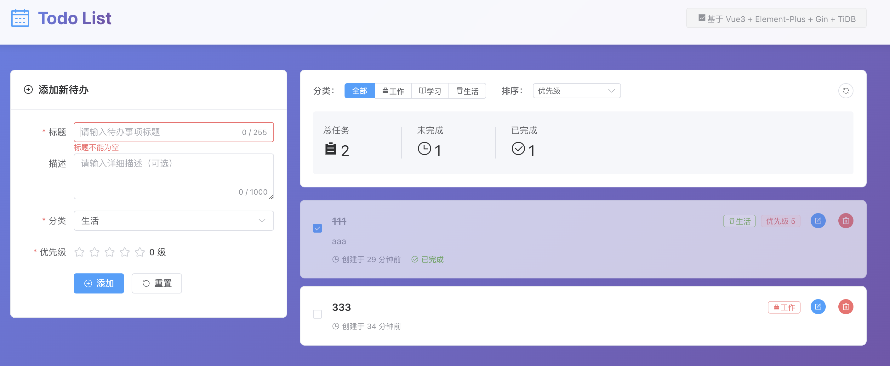
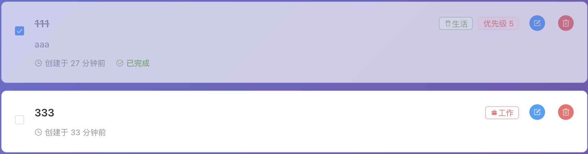

## TODO List 项目说明文档

### 1. 技术选型

- 编程语言：Go+html+css+JavaScript，理由：对Go较为熟悉，开发较为快速。

- 框架：后端用Gin框架，理由：基于前缀树进行路由匹配，相较于别的框架如Beego采用正则表达式的要快的多。前端用Vue3，理由：生态丰富，更加常见。
- 数据库：TiDB，理由：随着业务增长，只需增加节点即可平滑扩展成分布式集群、兼容MySQL 5.7协议，现有的 MySQL 工具链基本都能直接使用，避免后期更换麻烦
- 替代方案对比：在当前这种非常简单的场景下确实应该用mysql，但如果不考虑服务器的性能的话，采用TiDB可以避免后期重构分库分表的成本。相当于一步到位。


### 2.项目结构设计

采用前后端分离的架构，设定目录结构与职责如下：

```
coding-challenge--answer/
├── backend/                 # 后端服务
│   ├── main.go             # 入口文件
│   ├── config/             # 配置文件
│   │   └── config.go       # 数据库配置
│   ├── models/             # 数据模型
│   │   └── todo.go         # TODO模型定义
│   ├── controllers/        # 控制器
│   │   └── todo_controller.go
│   ├── services/           # 业务逻辑
│   │   └── todo_service.go
│   ├── middleware/         # 中间件
│   │   └── cors.go         # CORS处理
│   ├── router/             # 路由
│   │   └── router.go
│   ├── errors/             # 错误
│   │   └── errors.go
│   ├── utils/              # 工具类
│   │   └── response.go     # 统一回复格式
│   └── go.mod              # Go依赖管理
├── frontend/               # 前端应用
│   ├── src/
│   │   ├── main.js         # 入口文件
│   │   ├── App.vue         # 根组件
│   │   ├── components/     # 组件目录
│   │   │   ├── TodoList.vue    # TODO列表组件
│   │   │   ├── TodoItem.vue    # TODO项组件
│   │   │   └── AddTodo.vue     # 添加TODO组件
│   │   ├── api/            # API请求
│   │   │   └── todo.js
│   │   └── utils/          # 工具函数
│   │       └── request.js  # Axios封装
│   ├── package.json
│   └── vite.config.js
```

sql建表语句

```sql
CREATE TABLE todos (
    id BIGINT PRIMARY KEY AUTO_INCREMENT,
    title VARCHAR(255) NOT NULL,
    description TEXT,
    category ENUM('work', 'study', 'life') DEFAULT 'life',
    priority INT DEFAULT 0,
    completed BOOLEAN DEFAULT FALSE,
    version INT DEFAULT 0,  -- 用于乐观锁
    created_at TIMESTAMP DEFAULT CURRENT_TIMESTAMP,
    updated_at TIMESTAMP DEFAULT CURRENT_TIMESTAMP ON UPDATE CURRENT_TIMESTAMP
);

-- 索引优化
CREATE INDEX idx_category ON todos(category);
CREATE INDEX idx_priority ON todos(priority);
CREATE INDEX idx_completed ON todos(completed);
```


### 3.需求细节与决策

总体图片



1. 描述是否必填？如何处理空输入

   不是必填，建表语句中description的类型是TEXT，可以接受空输入

2. 已完成的任务如何显示？如图

3. 任务排序逻辑？

​	默认按照创建时间进行排序，越近的排越上；可以选择按优先级。还可以按照工作学习生活来进行分类

4. 扩展功能：

​	4.1 使用数据库来进行持久化

​	4.2 可以分类与排序，sql时采用相应的sql语句即可

​	4.3 由于在浏览器中运行，自然可以用ctrl+f来进行搜索

​	4.4 多设备协作，当前默认只有一个用户，假设操作如下：此用户在多个设备同时进行修改，然后设备1提交了修改，此时设备2再提交修改时显示


(接上文)此处用乐观锁思想来实现，毕竟同一个用户在多个设备同时进行修改的情况还是少见，不需要通过加锁的方式来进行数据更新，只需要为数据库添加一个version去做简单校验即可。


### 4.AI使用说明

使用Cursor搭配Claude来生成代码。具体环节为：前端整个项目的生成（因为对前端不熟悉）；后端基本的配置如数据库连接代码；后期发现代码中errors.New等相关报错字段过多，于是让ai把所有的错误回复给提炼到同一个文件，可以复用，不用每一次都新建一个错误。AI输出如何修改：ai给出的前端方案把后端的错误提示直接显示，对用户不友好，于是让它在前端用中文进行回复。


### 5.运行与测试方式

本地运行方式：可以用mysql也可以和开发项目一样用tidb，之后用navicat连接上数据库后，使用附上的建表语句。在backend文件夹下，go mod tidy之后go run main.go。在frontend文件夹下，npm install之后npm run dev即可

在后端代码中，数据模型层与服务层都配有测试代码，直接在backend文件夹下`go test -v ./...`即可

不足：没有做多用户，前端可以做的更漂亮一点；后端可以多添加一些功能比如添加截止日期、置顶提醒事项等等


### 6.总结与反思

如果有更多时间，我会增加登录与注册功能。

最大亮点：采用乐观锁思想去解决数据冲突。
