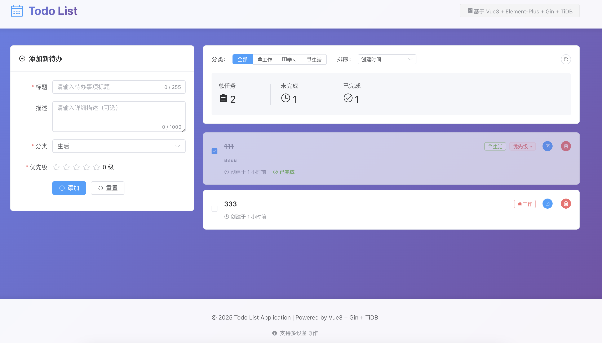

## 运行方式

本地运行方式：可以用mysql也可以和开发项目一样用tidb，本人用的是docker去启动数据库，简单的启动命令`docker run -d --name tidb-server -p 4000:4000 pingcap/tidb:latest`（此为简单测试环境，若需数据持久化则需要将数据目录挂载到宿主机上），之后用navicat连接上数据库后，使用附上的建表语句。在backend文件夹下，`go mod tidy`之后`go run main.go`。在frontend文件夹下，`npm install`之后`npm run dev`即可

在后端代码中，数据模型层与服务层都配有测试代码，若要运行测试代码直接在backend文件夹下`go test -v ./...`即可

运行起来后，大致效果如下：




建表语句

```sql
CREATE TABLE todos (
    id BIGINT PRIMARY KEY AUTO_INCREMENT,
    title VARCHAR(255) NOT NULL,
    description TEXT,
    category ENUM('work', 'study', 'life') DEFAULT 'life',
    priority INT DEFAULT 0,
    completed BOOLEAN DEFAULT FALSE,
    version INT DEFAULT 0,  -- 用于乐观锁
    created_at TIMESTAMP DEFAULT CURRENT_TIMESTAMP,
    updated_at TIMESTAMP DEFAULT CURRENT_TIMESTAMP ON UPDATE CURRENT_TIMESTAMP
);

-- 索引优化
CREATE INDEX idx_category ON todos(category);
CREATE INDEX idx_priority ON todos(priority);
CREATE INDEX idx_completed ON todos(completed);
```
